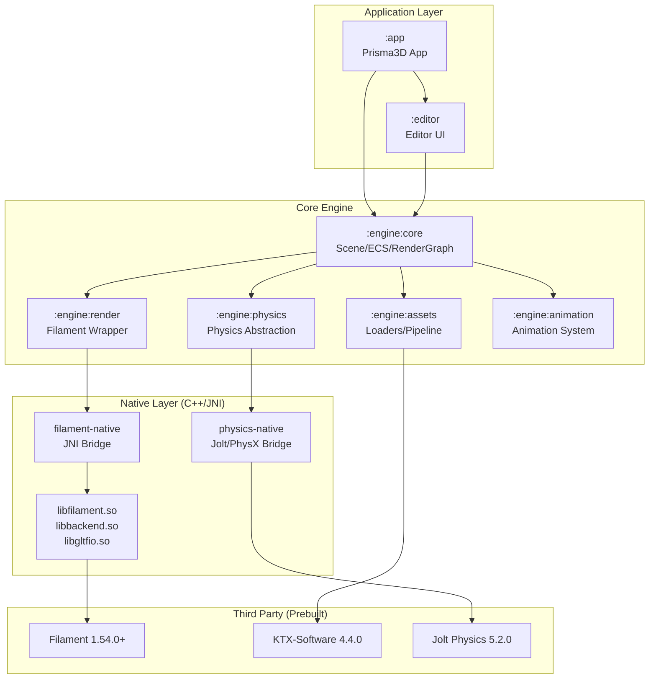

# Prisma 3D Clone Architecture

A high-performance 3D rendering engine for Android, inspired by Prisma 3D, built with Filament, OpenGL/Vulkan, and Kotlin Multiplatform.

## Table of Contents
- [Project Overview](#project-overview)
- [Module Diagram](#module-diagram)
- [Build Instructions](#build-instructions)
- [Requirements](#requirements)
- [Native Build Details](#native-build-details)
- [Contribution Guide](#contribution-guide)
- [License](#license)

---

## Project Overview

This project implements a professional-grade 3D engine architecture for Android, featuring:

- **Real-time PBR Rendering** via Google Filament (Vulkan/OpenGL ES backends)
- **Scene Graph & ECS** for efficient entity management
- **Physics Integration** (Jolt Physics / PhysX ready)
- **Animation System** with skeletal & morph target support
- **Asset Pipeline** (glTF 2.0, KTX2, Basis Universal)
- **Editor Layer** with gizmo manipulation, viewport rendering, and property panels
- **Headless Rendering** for thumbnail generation & batch processing

**Target Platforms:** Android API 24+ (Vulkan preferred, GLES3 fallback)

---

## Module Diagram



### Module Descriptions

| Module | Type | Description |
|--------|------|-------------|
| `:app` | Android App | Main application entry point, Activity/Fragment hosting |
| `:editor` | Android Library | Editor UI: viewport, inspector, hierarchy, asset browser |
| `:engine:core` | Kotlin/JVM | Scene graph, ECS, render graph, resource management |
| `:engine:render` | Kotlin/JVM | Filament API wrapper, material system, post-processing |
| `:engine:assets` | Kotlin/JVM | glTF/KTX loaders, asset processing pipeline, baking |
| `:engine:physics` | Kotlin/JVM | Physics abstraction layer (collision, dynamics, queries) |
| `:engine:animation` | Kotlin/JVM | Animation controller, blending, inverse kinematics |
| `filament-native` | CMake/Native | JNI bridge for Filament Engine, Swappy, Texture loading |
| `physics-native` | CMake/Native | JNI bridge for Jolt Physics / PhysX |

---

## Build Instructions

### Quick Start

```bash
# Clone with submodules
git clone --recurse-submodules https://github.com/yourorg/prisma3d-clone.git
cd prisma3d-clone

# Build debug APK
./gradlew assembleDebug

# Build release bundle
./gradlew bundleRelease

# Run connected tests
./gradlew connectedAndroidTest
```

### Build Variants

| Variant | Description |
|---------|-------------|
| `debug` | Debug symbols, validation layers, no minification |
| `release` | Optimized, minified, ProGuard/R8, Vulkan validation off |
| `profile` | Release + sampling profiler hooks |

### Gradle Tasks

```bash
# Native builds
./gradlew :filament-native:configureCMakeDebug
./gradlew :physics-native:configureCMakeRelease

# Generate compilation database for clangd
./gradlew generateClangdCompilationDatabase

# Dependency analysis
./gradlew :app:dependencies --configuration debugRuntimeClasspath
./gradlew dependencyUpdates

# Lint & formatting
./gradlew ktlintCheck detekt spotlessCheck
./gradlew spotlessApply  # Auto-fix
```

### IDE Setup

1. **Android Studio** Koala (2024.1.2)+ or IntelliJ IDEA 2024.2+
2. Install **Kotlin Multiplatform**, **NDK**, **CMake** plugins
3. Open `settings.gradle.kts` as project root
4. Run `./gradlew syncProject` or use *Sync Project with Gradle Files*

---

## Requirements

### Mandatory

| Tool | Version | Installation |
|------|---------|--------------|
| **JDK** | 17 (Temurin/Zulu/Oracle) | `sdk install java 17.0.11-tem` |
| **Android SDK** | API 34 (compileSdk 34) | Android Studio SDK Manager |
| **Android NDK** | 26.1.10909125 (r26c) | `sdkmanager "ndk;26.1.10909125"` |
| **CMake** | 3.22.1+ | `sdkmanager "cmake;3.22.1"` |
| **Gradle** | 8.5+ (Wrapper included) | N/A |

### Recommended

| Tool | Purpose |
|------|---------|
| **clangd** | C++ LSP for native code |
| **ktlint** | Kotlin formatting |
| **detekt** | Static analysis |
| **Git LFS** | Large binary assets (test models, textures) |

### Environment Variables

```bash
# ~/.bashrc / ~/.zshrc
export ANDROID_HOME="$HOME/Android/Sdk"
export ANDROID_NDK_HOME="$ANDROID_HOME/ndk/26.1.10909125"
export CMAKE_HOME="$ANDROID_HOME/cmake/3.22.1"
export PATH="$CMAKE_HOME/bin:$ANDROID_NDK_HOME:$PATH"

# Filament prebuilt location (CI caches this)
export FILAMENT_PREBUILT_DIR="$HOME/.cache/filament/1.54.0"
```

### Verify Setup

```bash
./gradlew --version
# Should show: Gradle 8.5, Kotlin 1.9.22, JVM 17

ndk-build --version
# GNU Make 4.3, Android NDK r26c

cmake --version
# cmake version 3.22.1
```

---

## Native Build Details (Filament Setup)

### Filament Version & Source

- **Version:** 1.54.0 (pinned via `gradle/libs.versions.toml`)
- **Source:** `https://github.com/google/filament/releases/tag/v1.54.0`
- **Prebuilts:** Downloaded via `filament-native/downloadFilament.gradle.kts`

### CMake Configuration (`filament-native/src/main/cpp/CMakeLists.txt`)

```cmake
cmake_minimum_required(VERSION 3.22)
project(filament-jni LANGUAGES CXX)

# Toolchain enforced by AGP via externalNativeBuild
set(CMAKE_CXX_STANDARD 20)
set(CMAKE_CXX_STANDARD_REQUIRED ON)
set(CMAKE_CXX_EXTENSIONS OFF)

# Filament prebuilt location
set(FILAMENT_ROOT "$ENV{FILAMENT_PREBUILT_DIR}" CACHE PATH "Filament prebuilt root")
if(NOT EXISTS "${FILAMENT_ROOT}/include/filament/Engine.h")
    message(FATAL_ERROR "Filament prebuilts not found at ${FILAMENT_ROOT}. Run ./gradlew downloadFilament")
endif()

# Include directories
include_directories(
    ${FILAMENT_ROOT}/include
    ${CMAKE_CURRENT_SOURCE_DIR}/include
)

# Shared library
add_library(filament-jni SHARED
    src/engine/EngineJNI.cpp
    src/renderer/RendererJNI.cpp
    src/material/MaterialJNI.cpp
    src/texture/TextureJNI.cpp
    src/swapchain/SwapChainJNI.cpp
    src/utils/Log.cpp
)

# Link Filament static libraries
target_link_libraries(filament-jni PRIVATE
    ${FILAMENT_ROOT}/lib/android/${ANDROID_ABI}/libfilament.a
    ${FILAMENT_ROOT}/lib/android/${ANDROID_ABI}/libbackend.a
    ${FILAMENT_ROOT}/lib/android/${ANDROID_ABI}/libgltfio.a
    ${FILAMENT_ROOT}/lib/android/${ANDROID_ABI}/libimage.a
    ${FILAMENT_ROOT}/lib/android/${ANDROID_ABI}/libmath.a
    ${FILAMENT_ROOT}/lib/android/${ANDROID_ABI}/libutils.a
    ${FILAMENT_ROOT}/lib/android/${ANDROID_ABI}/libbluegl.a
    ${FILAMENT_ROOT}/lib/android/${ANDROID_ABI}/libibl.a
    ${FILAMENT_ROOT}/lib/android/${ANDROID_ABI}/libsmol-v.a
    # System libs
    android log EGL GLESv3 vulkan
)

# Compile options
target_compile_options(filament-jni PRIVATE
    -Wall -Wextra -Wpedantic
    -Wno-unused-parameter
    -DFLIMENT_JNI_EXPORTS
    -DFILAMENT_SUPPORTS_VULKAN=1
    $<$<CONFIG:Debug>:-O0 -g -DDEBUG>
    $<$<CONFIG:Release>:-O3 -DNDEBUG -flto>
)

# JNI header generation
add_custom_command(
    OUTPUT ${CMAKE_CURRENT_BINARY_DIR}/generated/filament_jni.h
    COMMAND javah -classpath ...  # Handled by AGP via javah task
    DEPENDS ${CMAKE_CURRENT_SOURCE_DIR}/src/main/java/com/prisma3d/engine/native/FilamentJNI.java
)
```

### AGP Integration (`filament-native/build.gradle.kts`)

```kotlin
android {
    namespace = "com.prisma3d.engine.native"
    compileSdk = 34

    defaultConfig {
        minSdk = 24
        targetSdk = 34
        ndkVersion = "26.1.10909125"

        externalNativeBuild {
            cmake {
                version "3.22.1"
                arguments(
                    "-DANDROID_STL=c++_shared",
                    "-DANDROID_PLATFORM=android-24",
                    "-DCMAKE_BUILD_TYPE=\${BUILD_TYPE}",
                    "-DFILAMENT_PREBUILT_DIR=$filamentPrebuiltDir"
                )
                cppFlags("-std=c++20", "-Wall", "-Wextra")
                abiFilters("arm64-v8a", "x86_64") // x86_64 for emulator
            }
        }
    }

    externalNativeBuild {
        cmake {
            path "src/main/cpp/CMakeLists.txt"
        }
    }

    // Prebuilt download task
    tasks.register("downloadFilament", DownloadFilamentTask::class) {
        version.set("1.54.0")
        outputDir.set(layout.buildDirectory.dir("filament-prebuilt"))
    }
    tasks.named("preBuild").configure { dependsOn("downloadFilament") }
}
```

### Key JNI Entry Points (`EngineJNI.cpp`)

```cpp
#include <filament/Engine.h>
#include <filament/Renderer.h>
#include <filament/Scene.h>
#include <filament/View.h>
#include <filament/SwapChain.h>
#include <backend/DriverEnums.h>

extern "C" JNIEXPORT jlong JNICALL
Java_com_prisma3d_engine_native_FilamentJNI_nCreateEngine(
    JNIEnv* env, jclass clazz, jint backendType) {

    using namespace filament;
    Engine::Backend backend = static_cast<Engine::Backend>(backendType);
    Engine* engine = Engine::create(backend);
    return reinterpret_cast<jlong>(engine);
}

extern "C" JNIEXPORT void JNICALL
Java_com_prisma3d_engine_native_FilamentJNI_nDestroyEngine(
    JNIEnv* env, jclass clazz, jlong engineHandle) {
    filament::Engine::destroy(reinterpret_cast<filament::Engine*>(engineHandle));
}

extern "C" JNIEXPORT jlong JNICALL
Java_com_prisma3d_engine_native_FilamentJNI_nCreateSwapChain(
    JNIEnv* env, jclass clazz, jlong engineHandle, jobject surface, jint flags) {
    auto* engine = reinterpret_cast<filament::Engine*>(engineHandle);
    auto* nativeWindow = ANativeWindow_fromSurface(env, surface);
    SwapChain* swapChain = engine->createSwapChain(nativeWindow, flags);
    ANativeWindow_release(nativeWindow);
    return reinterpret_cast<jlong>(swapChain);
}

// Render loop callback
extern "C" JNIEXPORT void JNICALL
Java_com_prisma3d_engine_native_FilamentJNI_nBeginFrame(
    JNIEnv* env, jclass clazz, jlong engineHandle, jlong swapChainHandle) {
    auto* engine = reinterpret_cast<filament::Engine*>(engineHandle);
    auto* swapChain = reinterpret_cast<filament::SwapChain*>(swapChainHandle);
    if (engine->beginFrame(swapChain)) {
        // Frame begun successfully
    }
}
```

### Kotlin Wrapper (`Engine.kt`)

```kotlin
package com.prisma3d.engine.render

import android.view.Surface
import com.prisma3d.engine.native.FilamentJNI
import kotlinx.coroutines.Dispatchers
import kotlinx.coroutines.withContext

class FilamentEngine private constructor(
    private val nativeHandle: Long,
    private val backend: Backend
) : Closeable {

    companion object {
        @Volatile private var loaded = false

        fun create(backend: Backend = Backend.VULKAN): FilamentEngine = withContext(Dispatchers.IO) {
            if (!loaded) {
                System.loadLibrary("filament-jni")
                System.loadLibrary("c++_shared")
                loaded = true
            }
            val handle = FilamentJNI.nCreateEngine(backend.ordinal)
            FilamentEngine(handle, backend)
        }
    }

    fun createSwapChain(surface: Surface, config: SwapChainConfig = SwapChainConfig()): SwapChain {
        val handle = FilamentJNI.nCreateSwapChain(nativeHandle, surface, config.flags)
        return SwapChain(this, handle, surface)
    }

    fun beginFrame(swapChain: SwapChain): Boolean {
        return FilamentJNI.nBeginFrame(nativeHandle, swapChain.nativeHandle)
    }

    fun render(view: View, renderableManager: RenderableManager) {
        FilamentJNI.nRender(nativeHandle, view.nativeHandle, renderableManager.nativeHandle)
    }

    override fun close() {
        FilamentJNI.nDestroyEngine(nativeHandle)
    }

    enum class Backend { VULKAN, OPENGL }
    data class SwapChainConfig(
        val flags: Int = 0, // SWAP_CHAIN_CONFIG_ENABLE_MSAA, etc.
    )
}
```

### Vulkan Validation Layers (Debug Only)

```gradle
// app/build.gradle.kts
android {
    buildTypes {
        debug {
            externalNativeBuild {
                cmake {
                    arguments "-DCMAKE_BUILD_TYPE=Debug"
                }
            }
            // Enable GPU validation layers
            manifestPlaceholders = [enableVulkanValidation: "true"]
        }
        release {
            externalNativeBuild {
                cmake {
                    arguments "-DCMAKE_BUILD_TYPE=Release"
                }
            }
            manifestPlaceholders = [enableVulkanValidation: "false"]
        }
    }
}
```

```xml
<!-- app/src/debug/AndroidManifest.xml -->
<manifest>
    <application>
        <meta-data android:name="com.android.graphics.injectLayers.enable"
                   android:value="VK_LAYER_KHRONOS_validation" />
    </application>
</manifest>
```

---

## Contribution Guide

### Getting Started

1. **Fork** the repository
2. **Create a feature branch**: `git checkout -b feat/your-feature-name`
3. **Make changes** following coding standards
4. **Run checks**: `./gradlew spotlessCheck detekt ktlintCheck test`
5. **Submit PR** with clear description and linked issue

### Coding Standards

#### Kotlin (Kotlin 1.9.22, JVM 17)
- **Style:** [Kotlin Coding Conventions](https://kotlinlang.org/docs/coding-conventions.html) + `ktlint` (official ruleset)
- **Architecture:** Clean Architecture, Repository pattern, StateFlow/LiveData for UI state
- **Coroutines:** Structured concurrency, `viewModelScope`/`lifecycleScope`, avoid `GlobalScope`
- **Nullability:** Explicit `@Nullable`/`@NonNull` for platform types
- **Documentation:** KDoc for public API, `@SampleCode` for complex components

#### C++ (C++20, NDK r26c)
- **Style:** Google C++ Style Guide + `clang-format` (config-format` in repo root)
- **Memory:** RAII, `std::unique_ptr`/`shared_ptr`, no raw owning pointers
- **JNI:** Minimize transitions, batch calls, use `ScopedLocalRef`/`ScopedGlobalRef`
- **Error Handling:** Return `Result<T, E>` or `Expected<T, E>`, no exceptions across JNI boundary
- **Thread Safety:** Annotate with `ASSERT_THREAD(ThreadType::Render)` etc.

#### Commit Messages (Conventional Commits)
```
<type>(<scope>): <subject>

<body>

<footer>
```

| Type | Description |
|------|-------------|
| `feat` | New feature |
| `fix` | Bug fix |
| `refactor` | Code restructuring |
| `perf` | Performance improvement |
| `docs` | Documentation only |
| `test` | Test additions/changes |
| `chore` | Build, deps, tooling |
| `ci` | CI configuration |

**Example:**
```
feat(renderer): add bloom post-process effect

Implements configurable bloom with threshold, intensity, and knee parameters.
Uses Filament's PostProcessing API with custom compute shaders.

Closes #142
```

### Pull Request Checklist

- [ ] All CI checks pass (`./gradlew check`)
- [ ] No `ktlint`/`detekt` violations
- [ ] Native code formatted with `clang-format`
- [ ] Unit tests added/updated (target >80% coverage)
- [ ] Integration tests for new Filament features
- [ ] Documentation updated (README, KDoc, architecture docs)
- [ ] CHANGELOG.md entry added (unreleased section)
- [ ] No binary files committed (use Git LFS for assets)

### Code Review Guidelines

- **Reviewers:** Minimum 1 approval from core maintainer
- **Scope:** Focus on correctness, performance, API design, test coverage
- **Native Code:** Extra scrutiny for memory safety, JNI correctness, Vulkan synchronization
- **Render Pipeline:** Validate frame graph changes with RenderDoc captures

### Release Process

1. **Version Bump:** `./gradlew versionCatalogUpdate` + manual `gradle/libs.versions.toml`
2. **Changelog:** Generate from conventional commits
3. **Tag:** `git tag -a v1.2.0 -m "Release v1.2.0"`
4. **Publish:** `./gradlew publishAllPublicationsToMavenCentralRepository`
5. **GitHub Release:** Attach AAB, ProGuard mapping, native symbols

---

## License

### GPL-3.0 License

This project is licensed under the **GNU General Public License v3.0** - see [LICENSE](LICENSE) for full text.

```
Copyright (C) 2024 Prisma3D Clone Contributors

This program is free software: you can redistribute it and/or modify
it under the terms of the GNU General Public License as published by
the Free Software Foundation, either version 3 of the License, or
(at your option) any later version.

This program is distributed in the hope that it will be useful,
but WITHOUT ANY WARRANTY; without even the implied warranty of
MERCHANTABILITY or FITNESS FOR A PARTICULAR PURPOSE.  See the
GNU General Public License for more details.

You should have received a copy of the GNU General Public License
along with this program.  If not, see <https://www.gnu.org/licenses/>.
```

### Custom License Exceptions

The following components are bundled under compatible licenses with explicit exceptions:

| Component | License | Exception |
|-----------|---------|-----------|
| **Google Filament** | Apache-2.0 | Dynamic linking exception for GPL-3.0 compatibility |
| **KTX-Software** | Apache-2.0 | Same as above |
| **Jolt Physics** | MIT | Compatible, no exception needed |
| **glTF-Sample-Models** | CC0-1.0 / Apache-2.0 | Test assets only, not linked |
| **Spirit-X** (shaders) | MIT | Build-time only |

**Filament Dynamic Linking Exception:**
> As a special exception, the copyright holders of this library give you permission to link this library with independent modules to produce an executable, regardless of the license terms of these independent modules, and to copy and distribute the resulting executable under terms of your choice, provided that you also meet, for each linked independent module, the terms and conditions of the license of that module.

### Third-Party Notices

See [THIRD_PARTY_NOTICES.md](THIRD_PARTY_NOTICES.md) for complete attribution list.

### Contributor License Agreement

By contributing, you agree that your contributions will be licensed under GPL-3.0 with the above exceptions. No separate CLA required for individual contributors.

---

## Support & Community

- **Issues:** [GitHub Issues](https://github.com/yourorg/prisma3d-clone/issues)
- **Discussions:** [GitHub Discussions](https://github.com/yourorg/prisma3d-clone/discussions)
- **Discord:** [Prisma3D Clone Dev](https://discord.gg/prisma3d-clone)
- **Documentation:** [Wiki](https://github.com/yourorg/prisma3d-clone/wiki)

---

*Built with ❤️ using Filament, Kotlin, and modern Android graphics APIs.*